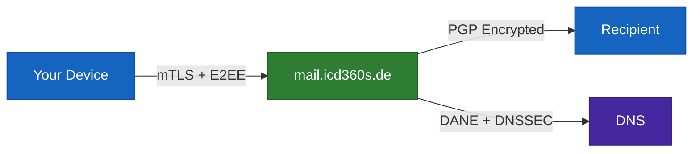

<div align="center">
  

  # ICD360S Mail

  **Secure, end-to-end encrypted email for desktop and mobile**

  Your emails are encrypted so only you and your recipient can read them.

  <br/>

  [](https://github.com/ICD360S-e-V/mail/releases/latest)
  [](https://github.com/ICD360S-e-V/mail/actions)
  [](LICENSE)
  [](REUSE.toml)

  <br/>

  
  
  
  
  

  <br/><br/>

  [](https://flutter.dev)
  [](https://www.rfc-editor.org/rfc/rfc9580)
  []()
  []()
  []()

</div>

---

> [!IMPORTANT]
> **Your emails are never stored on your device.** They are fetched live over mutually authenticated TLS and displayed in memory only. No forensic artifact remains after the app closes.

---

## How It Works



<table>
<tr>
<td width="50%">

### :eye: What the server sees
- Sender address
- Recipient address
- Subject line
- Date and time
- Message size

</td>
<td width="50%">

### :lock: What's encrypted (E2EE)
- **Message body**
- **Attachments**
- **Attachment names & types**
- **Inner MIME structure**
- **Everything inside the payload**

</td>
</tr>
</table>

---

## Features

<table>
<tr>
<td valign="top" width="50%">

### :lock: Encryption
- **OpenPGP E2EE** — PGP/MIME (RFC 3156)
- **Native Go engine** — 27 MB in < 1 sec
- **TOFU key pinning** — warns on key change
- **Zero-access storage** — admin can't read mail
- **WKD** — auto key discovery for Thunderbird/ProtonMail
- **Autocrypt** — key exchange in every email
- **Password-protected mail** — AES-256-GCM for external recipients

</td>
<td valign="top" width="50%">

### :shield: Authentication
- **Mutual TLS** — per-user client certificates
- **Device approval** — admin-controlled enrollment
- **Remote revocation** — instant wipe on revoke
- **PIN unlock** — randomized keypad layout
- **DANE + DNSSEC** — verified transport
- **ARC signing** — auth preserved on forward

</td>
</tr>
<tr>
<td valign="top" width="50%">

### :see_no_evil: Privacy
- **RAM-only cache** — zero disk, wiped on lock
- **Self-hosted DoH** — no Google, no Cloudflare
- **Header stripping** — IP/hostname removed from outgoing
- **PII-safe logging** — auto-redaction of sensitive data
- **No telemetry** — zero analytics, zero tracking

</td>
<td valign="top" width="50%">

### :bar_chart: Security Monitoring
- **10 health checks** every 30 minutes
- SPF, DKIM, DMARC, MTA-STS, TLS-RPT
- CAA, DNSSEC, DANE (TLSA)
- IPv4/IPv6 blacklist (43 providers)
- **Recipient security** in compose — E2EE / DANE / TLS / Plaintext

</td>
</tr>
</table>

---

## Cryptography

> [!NOTE]
> All cryptographic operations use modern, audited standards. No legacy algorithms.

| Component | Standard |
|:---|:---|
| :key: Signing | Ed25519 (EdDSA) |
| :closed_lock_with_key: Encryption | X25519 / ECDH (Curve25519) |
| :envelope: Messages | OpenPGP (RFC 9580, PGP/MIME RFC 3156) |
| :bank: Vault | AES-256-GCM + Argon2id (64 MiB / 3 iters / 4 threads) |
| :satellite: Transport | Mutual TLS + DANE (TLSA 3 1 1) + DNSSEC |
| :mag: Key discovery | WKD + Autocrypt Level 1 |

---

## Download

> [!TIP]
> All downloads are served over HTTPS with cryptographically signed version verification.

### Desktop

<p align="center">
  <a href="https://mail.icd360s.de/downloads/mail/windows/icd360s-mail-setup.exe"></a>
  &nbsp;
  <a href="https://mail.icd360s.de/downloads/mail/macos/icd360s-mail.dmg"></a>
  &nbsp;
  <a href="https://mail.icd360s.de/downloads/mail/linux/icd360s-mail.AppImage"></a>
</p>

<details>
<summary><kbd>Linux packages: DEB, RPM, tar.gz</kbd></summary>

| Format | Download |
|:---|:---|
| DEB (Ubuntu/Debian) | [icd360s-mail.deb](https://mail.icd360s.de/downloads/mail/linux/icd360s-mail.deb) |
| RPM (Fedora/RHEL) | [icd360s-mail.rpm](https://mail.icd360s.de/downloads/mail/linux/icd360s-mail.rpm) |
| tar.gz | [icd360s-mail-linux.tar.gz](https://mail.icd360s.de/downloads/mail/linux/icd360s-mail-linux.tar.gz) |

</details>

### Mobile

<p align="center">
  <a href="https://mail.icd360s.de/downloads/mail/android/universal/app-arm64-v8a-universal-release.apk"></a>
  &nbsp;
  <a href="https://mail.icd360s.de/downloads/mail/ios/icd360s-mail.ipa"></a>
</p>

<details>
<summary><kbd>Android flavors: F-Droid, Samsung, Huawei, Google Play</kbd></summary>

| Flavor | ARM64 | ARMv7 | x86_64 |
|:---|:---|:---|:---|
| Universal | [Download](https://mail.icd360s.de/downloads/mail/android/universal/app-arm64-v8a-universal-release.apk) | [Download](https://mail.icd360s.de/downloads/mail/android/universal/app-armeabi-v7a-universal-release.apk) | [Download](https://mail.icd360s.de/downloads/mail/android/universal/app-x86_64-universal-release.apk) |
| F-Droid | [Download](https://mail.icd360s.de/downloads/mail/android/fdroid/app-arm64-v8a-fdroid-release.apk) | [Download](https://mail.icd360s.de/downloads/mail/android/fdroid/app-armeabi-v7a-fdroid-release.apk) | [Download](https://mail.icd360s.de/downloads/mail/android/fdroid/app-x86_64-fdroid-release.apk) |
| Samsung | [Download](https://mail.icd360s.de/downloads/mail/android/samsung/app-arm64-v8a-samsung-release.apk) | [Download](https://mail.icd360s.de/downloads/mail/android/samsung/app-armeabi-v7a-samsung-release.apk) | [Download](https://mail.icd360s.de/downloads/mail/android/samsung/app-x86_64-samsung-release.apk) |
| Huawei | [Download](https://mail.icd360s.de/downloads/mail/android/huawei/app-arm64-v8a-huawei-release.apk) | [Download](https://mail.icd360s.de/downloads/mail/android/huawei/app-armeabi-v7a-huawei-release.apk) | [Download](https://mail.icd360s.de/downloads/mail/android/huawei/app-x86_64-huawei-release.apk) |
| Google Play | [Download](https://mail.icd360s.de/downloads/mail/android/googleplay/app-arm64-v8a-googleplay-release.apk) | [Download](https://mail.icd360s.de/downloads/mail/android/googleplay/app-armeabi-v7a-googleplay-release.apk) | [Download](https://mail.icd360s.de/downloads/mail/android/googleplay/app-x86_64-googleplay-release.apk) |

</details>

---

## Building from Source

```bash
git clone https://github.com/ICD360S-e-V/mail.git
cd mail && flutter pub get
flutter run -d macos    # or: windows, linux
```

<details>
<summary><kbd>Platform requirements</kbd></summary>

| Platform | Requirements |
|:---|:---|
| All | Flutter 3.41+, Dart 3.6+ |
| Android | Java 17, Android SDK |
| iOS/macOS | Xcode 15+ |
| Linux | `libgtk-3-dev`, `libsecret-1-dev`, `libjsoncpp-dev` |
| Windows | Visual Studio 2022 with C++ workload |

</details>

---

## About ICD360S e.V.

[ICD360S e.V.](https://icd360s.de) is a registered German nonprofit (*eingetragener Verein*). Every active member receives a free, secure `@icd360s.de` email account with E2E encryption and cross-platform access.

> [!CAUTION]
> The live service at `mail.icd360s.de` is available **exclusively to members**. This repository contains the open-source code — the operational service is private.

---

<div align="center">

[:scroll: Security Policy](SECURITY.md) · [:wheelchair: Accessibility](ACCESSIBILITY.md) · [:handshake: Contributing](CONTRIBUTING.md) · [:page_facing_up: License](LICENSE)

<br/>

**[ICD360S e.V.](https://icd360s.de)** · Amtsgericht Memmingen, VR 201335

[kontakt@icd360s.de](mailto:kontakt@icd360s.de) · [Impressum](https://icd360s.de/impressum/) · [Datenschutz](https://icd360s.de/datenschutz/)

</div>
