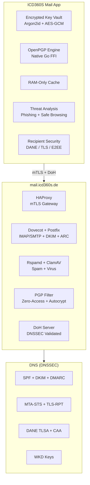

<div align="center">
  
  <h1>ICD360S Mail</h1>
  <p><strong>Secure, end-to-end encrypted email client for desktop and mobile</strong></p>
  <p>Your emails are encrypted so only you and your recipient can read them.<br/>Built by a German nonprofit. Open source. Zero tracking.</p>

  <br/>

  [](https://github.com/ICD360S-e-V/mail/releases/latest)
  [](https://github.com/ICD360S-e-V/mail/actions)
  [](LICENSE)
  [](REUSE.toml)
  <br/>
  [](https://flutter.dev)
  [](https://www.rfc-editor.org/rfc/rfc9580)
  [](ACCESSIBILITY.md)
  [](#download)
</div>

<br/>

<div align="center">
<table>
<tr>
<td align="center"><strong>:lock: E2EE</strong><br/><sub>OpenPGP encryption<br/>for all internal mail</sub></td>
<td align="center"><strong>:shield: mTLS</strong><br/><sub>Per-user certificates<br/>no passwords on wire</sub></td>
<td align="center"><strong>:brain: RAM-Only</strong><br/><sub>Zero disk persistence<br/>wiped on lock</sub></td>
<td align="center"><strong>:earth_americas: Private DNS</strong><br/><sub>Self-hosted DoH<br/>no third-party DNS</sub></td>
<td align="center"><strong>:no_entry: Zero Telemetry</strong><br/><sub>No analytics<br/>no tracking, no CDN</sub></td>
</tr>
</table>
</div>

---

## About

ICD360S Mail is a security-first email client built for [ICD360S e.V.](https://icd360s.de), a German nonprofit. It provides end-to-end encrypted email communication with a zero-knowledge architecture.

**Your emails are never stored on your device.** They are fetched live over mutually authenticated TLS and displayed in memory only. No forensic artifact remains after the app closes.

---

## Features

<details open>
<summary><h3>:lock: Encryption</h3></summary>

| Feature | Details |
|---|---|
| **E2EE Internal Mail** | All `@icd360s.de` emails encrypted end-to-end (PGP/MIME, RFC 3156). Server sees only encrypted blobs. |
| **Native PGP Engine** | Go-based OpenPGP via FFI. 27 MB message encrypts in < 1 second on mobile. |
| **PGP/MIME Attachments** | Attachments encrypted inside PGP payload. No metadata leaks. |
| **Automatic Key Management** | Keys generated on device, stored in encrypted vault. TOFU key pinning. |
| **Zero-Access at Rest** | Incoming mail encrypted on server before storage. Admin cannot read messages. |
| **Password-Protected Email** | Send encrypted email to anyone. Client-side AES-256-GCM decryption in browser. |
| **WKD Key Discovery** | Thunderbird, ProtonMail, GnuPG auto-discover keys via Web Key Directory. |
| **Autocrypt** | Every outgoing email carries your public key for automatic key exchange. |

</details>

<details open>
<summary><h3>:shield: Authentication & Protection</h3></summary>

| Feature | Details |
|---|---|
| **Mutual TLS** | Per-user client certificates. No passwords on the wire. |
| **Device Approval** | Admin-controlled registration with single-device enforcement. |
| **Remote Revocation** | Admin revokes device -- app auto-wipes and locks. |
| **PIN Unlock** | 6-digit PIN with randomized keypad. Defeats shoulder surfing. |
| **ClamAV Scanning** | Dual-layer: server-side + on-demand from app. |
| **Rspamd Filtering** | Bayesian, DNSBL, fuzzy hashing, phishing detection. |
| **3-Layer Phishing** | Display/href mismatch, IDN homographs, offline Safe Browsing DB (ECDSA verified). |
| **HTML Sanitizer** | DOM allowlist renderer. No WebView. No JavaScript. |
| **Recipient Security** | Compose window shows per-recipient: E2EE / DANE+TLS / TLS / Plaintext. |
| **ARC Signing** | Authenticated Received Chain preserves auth across forwarding. |

</details>

<details open>
<summary><h3>:bar_chart: Email Health Monitor</h3></summary>

Real-time dashboard checking **10 security indicators** every 30 minutes via self-hosted DoH:

```
 SPF          ████████████████████  OK
 DKIM         ████████████████████  OK
 DMARC        ████████████████████  OK     p=reject
 MTA-STS      ████████████████████  OK     mode=enforce
 TLS-RPT      ████████████████████  OK
 CAA          ████████████████████  OK     issue=letsencrypt.org
 DNSSEC       ████████████████████  OK     AD flag verified
 DANE         ████████████████████  OK     TLSA 3 1 1
 IPv4 BL      ████████████████████  CLEAN  29 providers checked
 IPv6 BL      ████████████████████  CLEAN  14 providers checked
```

</details>

<details open>
<summary><h3>:see_no_evil: Privacy</h3></summary>

| Feature | Details |
|---|---|
| **RAM-Only Cache** | Emails in memory only. Zero disk. Wiped on lock. |
| **Self-Hosted DoH** | DNS queries via own server. No Google, no Cloudflare. |
| **PII-Safe Logging** | Auto-redaction of emails, IPs, phones, subjects. |
| **Header Privacy** | Internal headers stripped from outgoing mail. |
| **Notification Privacy** | Configurable: minimal, sender only, or full content. |
| **No Telemetry** | Zero analytics. Zero tracking. Zero CDN dependencies. |

</details>

<details>
<summary><h3>:writing_hand: Compose & Accessibility</h3></summary>

| Feature | Details |
|---|---|
| **Real-Time Upload** | Attachments upload with progress bar + KB/s speed. |
| **Draft Auto-Save** | Every 5 seconds. Pauses during send. |
| **Swipe to Delete** | Swipe left on any email. |
| **WCAG 2.1 AA** | Screen reader support, keyboard navigation, font scaling. [Details](ACCESSIBILITY.md) |

</details>

---

## What the Server Sees

<table>
<tr>
<th>:eye: Visible to Server</th>
<th>:lock: Encrypted (E2EE)</th>
</tr>
<tr>
<td>Sender address<br/>Recipient address<br/>Subject line<br/>Date and time<br/>Message size</td>
<td><strong>Message body</strong><br/><strong>Attachments</strong><br/><strong>Attachment names & types</strong><br/><strong>Inner MIME structure</strong><br/><strong>Everything inside the payload</strong></td>
</tr>
</table>

---

## Cryptography

| Component | Standard |
|---|---|
| Signing | Ed25519 (EdDSA) |
| Encryption | X25519 / ECDH (Curve25519) |
| Messages | OpenPGP (RFC 9580, PGP/MIME RFC 3156) |
| Vault | AES-256-GCM + Argon2id (64 MiB / 3 iters / 4 threads) |
| Transport | Mutual TLS + DANE (TLSA 3 1 1) + DNSSEC |
| Key discovery | WKD + Autocrypt Level 1 |

---

## Architecture



---

## Download

> All downloads served over HTTPS with signed version verification.

### Desktop

<table>
<tr>
<td align="center" width="200">
<br/><a href="https://mail.icd360s.de/downloads/mail/windows/icd360s-mail-setup.exe"><strong>Windows</strong></a><br/><sub>Installer (.exe)</sub><br/><br/>
<a href="https://mail.icd360s.de/downloads/mail/windows/icd360s-mail-setup.exe"></a><br/><br/>

</td>
<td align="center" width="200">
<br/><a href="https://mail.icd360s.de/downloads/mail/macos/icd360s-mail.dmg"><strong>macOS</strong></a><br/><sub>DMG</sub><br/><br/>
<a href="https://mail.icd360s.de/downloads/mail/macos/icd360s-mail.dmg"></a><br/><br/>

</td>
<td align="center" width="200">
<br/><strong>Linux</strong><br/><sub>DEB, RPM, AppImage, tar.gz</sub><br/><br/>
<a href="https://mail.icd360s.de/downloads/mail/linux/icd360s-mail.deb"></a>
<a href="https://mail.icd360s.de/downloads/mail/linux/icd360s-mail.rpm"></a><br/>
<a href="https://mail.icd360s.de/downloads/mail/linux/icd360s-mail.AppImage"></a>
<a href="https://mail.icd360s.de/downloads/mail/linux/icd360s-mail-linux.tar.gz"></a><br/><br/>

</td>
</tr>
</table>

### Mobile

<table>
<tr>
<td align="center" width="250">
<br/><strong>Android</strong><br/><sub>APK -- multiple flavors</sub><br/><br/>
<a href="https://mail.icd360s.de/downloads/mail/android/universal/app-arm64-v8a-universal-release.apk"></a><br/>
<a href="https://mail.icd360s.de/downloads/mail/android/fdroid/app-arm64-v8a-fdroid-release.apk"></a>
<a href="https://mail.icd360s.de/downloads/mail/android/samsung/app-arm64-v8a-samsung-release.apk"></a>
<a href="https://mail.icd360s.de/downloads/mail/android/huawei/app-arm64-v8a-huawei-release.apk"></a><br/><br/>

</td>
<td align="center" width="250">
<br/><strong>iOS</strong><br/><sub>IPA (Sideload)</sub><br/><br/>
<a href="https://mail.icd360s.de/downloads/mail/ios/icd360s-mail.ipa"></a><br/><br/>

</td>
</tr>
</table>

<details>
<summary><strong>Other Android architectures</strong></summary>

| Flavor | ARMv7 | x86_64 |
|:---|:---|:---|
| Universal | [Download](https://mail.icd360s.de/downloads/mail/android/universal/app-armeabi-v7a-universal-release.apk) | [Download](https://mail.icd360s.de/downloads/mail/android/universal/app-x86_64-universal-release.apk) |
| F-Droid | [Download](https://mail.icd360s.de/downloads/mail/android/fdroid/app-armeabi-v7a-fdroid-release.apk) | [Download](https://mail.icd360s.de/downloads/mail/android/fdroid/app-x86_64-fdroid-release.apk) |
| Samsung | [Download](https://mail.icd360s.de/downloads/mail/android/samsung/app-armeabi-v7a-samsung-release.apk) | [Download](https://mail.icd360s.de/downloads/mail/android/samsung/app-x86_64-samsung-release.apk) |
| Huawei | [Download](https://mail.icd360s.de/downloads/mail/android/huawei/app-armeabi-v7a-huawei-release.apk) | [Download](https://mail.icd360s.de/downloads/mail/android/huawei/app-x86_64-huawei-release.apk) |

</details>

---

## Building from Source

```bash
git clone https://github.com/ICD360S-e-V/mail.git
cd mail && flutter pub get
flutter run -d macos    # or: windows, linux
```

<details>
<summary><strong>Platform requirements</strong></summary>

| Platform | Requirements |
|:---|:---|
| All | Flutter 3.41+, Dart 3.6+ |
| Android | Java 17, Android SDK |
| iOS/macOS | Xcode 15+ |
| Linux | `libgtk-3-dev`, `libsecret-1-dev`, `libjsoncpp-dev` |
| Windows | Visual Studio 2022 with C++ workload |

</details>

---

## Security

Report vulnerabilities responsibly. See [SECURITY.md](SECURITY.md).

## Contributing

Contributions welcome under AGPL-3.0. See [CONTRIBUTING.md](CONTRIBUTING.md).

## License

**GNU Affero General Public License v3.0** -- see [LICENSE](LICENSE). You may use, modify, and distribute freely. You must publish source code of modified versions and credit ICD360S e.V.

---

<div align="center">

**[ICD360S e.V.](https://icd360s.de)** -- Registered nonprofit, Amtsgericht Memmingen, VR 201335

[kontakt@icd360s.de](mailto:kontakt@icd360s.de)

</div>
