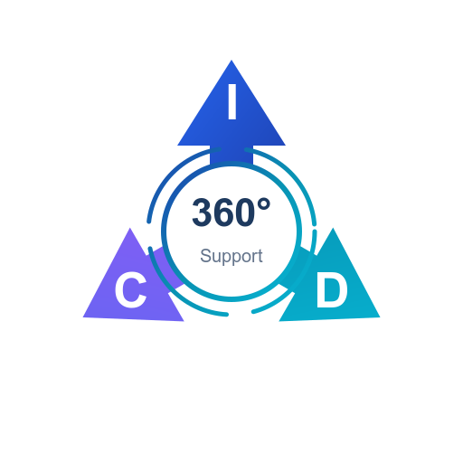

<div align="center">
  
  <h1>ICD360S Mail</h1>
  <p><strong>Secure, end-to-end encrypted email client</strong></p>
  <p>Built with Flutter for Windows, macOS, Linux, Android & iOS</p>

  <br/>

  [](https://github.com/ICD360S-e-V/mail/releases/latest)
  [](https://github.com/ICD360S-e-V/mail/actions)
  [](LICENSE)
  <br/>
  [](https://flutter.dev)
  [](https://dart.dev)
  [](https://www.rfc-editor.org/rfc/rfc9580)
</div>

---

## About

ICD360S Mail is a security-first email client built for [ICD360S e.V.](https://icd360s.de), a German nonprofit. It provides end-to-end encrypted email communication with a zero-knowledge architecture.

**Your emails are never stored on your device.** They are fetched live over mutually authenticated TLS and displayed in memory only. No forensic artifact remains after the app closes.

---

## Features

### Encryption

| Feature | Details |
|---|---|
| **E2EE Internal Mail** | All emails between `@icd360s.de` addresses are automatically encrypted end-to-end using OpenPGP (PGP/MIME, RFC 3156). The server only sees an encrypted blob — body text and attachments are invisible to anyone without the recipient's private key. |
| **PGP/MIME Attachments** | Attachments are encrypted inside the PGP payload alongside the message body. No metadata about attachment names or types leaks to the server. |
| **Automatic Key Management** | Keys are generated on device, stored in an encrypted vault, and synced between devices. Persistent key pinning warns if a recipient's key changes unexpectedly. |
| **Zero-Access at Rest** | Incoming mail is encrypted on the server before storage. Even the server administrator cannot read stored messages. |
| **Password-Protected Email** | Send encrypted email to anyone externally. Recipient opens a secure link, enters password, reads in browser. 100% client-side decryption. |
| **Key Discovery** | External clients can auto-discover your public key via Web Key Directory (WKD). |

### Authentication

| Feature | Details |
|---|---|
| **Mutual TLS** | Per-user client certificates. No passwords on the wire. |
| **Device Approval** | Admin-controlled device registration with single-device enforcement. |
| **Remote Revocation** | Admin revokes a device — app auto-wipes credentials and locks instantly. |
| **PIN Unlock** | 6-digit PIN with randomized keypad layout. Defeats shoulder surfing and smudge attacks. |

### Protection

| Feature | Details |
|---|---|
| **Virus Scanning** | Server-side antivirus scanning on all attachments with real-time status in the app. |
| **Multi-Layer Spam Filtering** | Inbound mail passes through reputation checks, DNSBL, Bayesian filtering, and phishing detection. |
| **Threat Intelligence** | DMARC, DKIM, SPF validation. DNS blacklist checks. Sender reputation scoring. |
| **Phishing Detection** | Offline threat database with cryptographic signature verification. |
| **HTML Sanitizer** | Allowlist-based HTML renderer blocks tracking pixels, scripts, and CSS exploits. No WebView. |

### Privacy

| Feature | Details |
|---|---|
| **RAM-Only Cache** | Emails exist only in process memory. Zero disk persistence. Wiped on lock. |
| **DNS-over-HTTPS** | All DNS queries are encrypted. No cleartext DNS leaves the device. |
| **PII-Safe Logging** | All diagnostic logs pass through automatic PII redaction before storage or upload. Email addresses, IPs, and subjects are sanitized. |
| **Notification Privacy** | Configurable lock screen notifications: minimal, sender only, or full content. |
| **No Telemetry** | Zero analytics. Zero tracking. Zero CDN dependencies. |

---

## Internal E2EE: What the Server Sees

When a member sends an email to another `@icd360s.de` address, the message is encrypted **on the sender's device** before it leaves.

| Visible to Server | Encrypted (E2EE) |
|---|---|
| Sender address | Message body |
| Recipient address | Attachments |
| Subject line | Attachment names and types |
| Date and time | Inner MIME structure |
| Message size | Everything inside the encrypted payload |

The server sees only the SMTP envelope and a single encrypted blob. Even a compromised server or malicious admin cannot decrypt the message content — only the recipient's device holds the private key.

> **Note:** Subject lines are currently visible in the outer headers (standard PGP/MIME behavior). Protected headers for encrypted subjects may be added in a future version.

---

## Architecture

```
                        ┌─────────────────────────┐
                        │     ICD360S Mail App     │
                        │                         │
                        │  Encrypted Key Vault     │
                        │  OpenPGP (RFC 9580)      │
                        │  RAM-Only Email Cache    │
                        │  Threat Analysis Engine  │
                        └────────────┬────────────┘
                                     │
                              mTLS + DoH
                                     │
                        ┌────────────┴────────────┐
                        │    mail.icd360s.de       │
                        │                         │
                        │  mTLS Gateway            │
                        │  IMAP + SMTP Services    │
                        │  Spam & Virus Filtering  │
                        │  Zero-Access Encryption  │
                        │  Key Directory (WKD)     │
                        └─────────────────────────┘
```

---

## Download

> All downloads are served over HTTPS with cryptographically signed version verification.

### Desktop

<table>
<tr>
<td align="center" width="200">
<br/>
<a href="https://mail.icd360s.de/downloads/mail/windows/icd360s-mail-setup.exe"><strong>Windows</strong></a><br/>
<sub>Installer (.exe)</sub><br/><br/>
<a href="https://mail.icd360s.de/downloads/mail/windows/icd360s-mail-setup.exe">

</a><br/><br/>

</td>
<td align="center" width="200">
<br/>
<a href="https://mail.icd360s.de/downloads/mail/macos/icd360s-mail.dmg"><strong>macOS</strong></a><br/>
<sub>DMG (Hardened Runtime)</sub><br/><br/>
<a href="https://mail.icd360s.de/downloads/mail/macos/icd360s-mail.dmg">

</a><br/><br/>

</td>
<td align="center" width="200">
<br/>
<strong>Linux</strong><br/>
<sub>DEB, RPM, AppImage, tar.gz</sub><br/><br/>
<a href="https://mail.icd360s.de/downloads/mail/linux/icd360s-mail.deb">

</a>
<a href="https://mail.icd360s.de/downloads/mail/linux/icd360s-mail.rpm">

</a><br/>
<a href="https://mail.icd360s.de/downloads/mail/linux/icd360s-mail.AppImage">

</a>
<a href="https://mail.icd360s.de/downloads/mail/linux/icd360s-mail-linux.tar.gz">

</a><br/><br/>

</td>
</tr>
</table>

### Mobile

<table>
<tr>
<td align="center" width="250">
<br/>
<strong>Android</strong><br/>
<sub>APK — multiple flavors</sub><br/><br/>
<a href="https://mail.icd360s.de/downloads/mail/android/universal/app-arm64-v8a-universal-release.apk">

</a><br/>
<a href="https://mail.icd360s.de/downloads/mail/android/fdroid/app-arm64-v8a-fdroid-release.apk">

</a>
<a href="https://mail.icd360s.de/downloads/mail/android/samsung/app-arm64-v8a-samsung-release.apk">

</a><br/>
<a href="https://mail.icd360s.de/downloads/mail/android/huawei/app-arm64-v8a-huawei-release.apk">

</a>
<a href="https://mail.icd360s.de/downloads/mail/android/googleplay/app-arm64-v8a-googleplay-release.apk">

</a><br/><br/>

</td>
<td align="center" width="250">
<br/>
<strong>iOS</strong><br/>
<sub>IPA (Sideload)</sub><br/><br/>
<a href="https://mail.icd360s.de/downloads/mail/ios/icd360s-mail.ipa">

</a><br/><br/>

</td>
</tr>
</table>

<details>
<summary><strong>Other Android architectures (ARMv7, x86_64)</strong></summary>

| Flavor | ARMv7 | x86_64 |
|:---|:---|:---|
| Universal | [Download](https://mail.icd360s.de/downloads/mail/android/universal/app-armeabi-v7a-universal-release.apk) | [Download](https://mail.icd360s.de/downloads/mail/android/universal/app-x86_64-universal-release.apk) |
| F-Droid | [Download](https://mail.icd360s.de/downloads/mail/android/fdroid/app-armeabi-v7a-fdroid-release.apk) | [Download](https://mail.icd360s.de/downloads/mail/android/fdroid/app-x86_64-fdroid-release.apk) |
| Samsung | [Download](https://mail.icd360s.de/downloads/mail/android/samsung/app-armeabi-v7a-samsung-release.apk) | [Download](https://mail.icd360s.de/downloads/mail/android/samsung/app-x86_64-samsung-release.apk) |
| Google Play | [Download](https://mail.icd360s.de/downloads/mail/android/googleplay/app-armeabi-v7a-googleplay-release.apk) | [Download](https://mail.icd360s.de/downloads/mail/android/googleplay/app-x86_64-googleplay-release.apk) |
| Huawei | [Download](https://mail.icd360s.de/downloads/mail/android/huawei/app-armeabi-v7a-huawei-release.apk) | [Download](https://mail.icd360s.de/downloads/mail/android/huawei/app-x86_64-huawei-release.apk) |
| Google Play AAB | — | [Download AAB](https://mail.icd360s.de/downloads/mail/android/googleplay/icd360s-mail.aab) |

</details>

---

## Building from Source

```bash
# Prerequisites: Flutter 3.41+, Dart 3.6+

git clone https://github.com/ICD360S-e-V/mail.git
cd mail
flutter pub get

# Run
flutter run -d macos       # or: windows, linux

# Build release
flutter build macos --release
flutter build windows --release
flutter build linux --release
flutter build apk --release
```

<details>
<summary><strong>Platform-specific requirements</strong></summary>

| Platform | Requirements |
|:---|:---|
| Android | Java 17, Android SDK |
| iOS/macOS | Xcode 15+ |
| Linux | `libgtk-3-dev`, `libsecret-1-dev`, `libjsoncpp-dev` |
| Windows | Visual Studio 2022 with C++ workload |

</details>

---

## Security

Please report security vulnerabilities responsibly. See [SECURITY.md](SECURITY.md) for our disclosure policy and PGP key.

---

## Versioning

Automated with [Conventional Commits](https://www.conventionalcommits.org/):

```
fix:      → patch    (2.39.0 → 2.39.1)
feat:     → minor    (2.39.0 → 2.40.0)
security: → minor    (2.39.0 → 2.40.0)
feat!:    → major    (2.39.0 → 3.0.0)
```

Every push to `main` with a releasable commit automatically bumps the version, creates a tag, and triggers a full multi-platform build.

---

## About ICD360S e.V.

[ICD360S e.V.](https://icd360s.de) is a registered German nonprofit (*eingetragener Verein*) based in Neu-Ulm, Bavaria.

**Registration:** Amtsgericht Memmingen, VR 201335

This email client is designed for **professional communication** — both within the association and with external institutions, organizations, and individuals.

### Membership Benefits

Every active member receives a free, secure email account:

| Benefit |
|---|
| **Unlimited** incoming emails |
| **500 MB** mailbox storage per account |
| **10 emails/day** sending limit (3 per hour) |
| **End-to-end encrypted** communication with all members |
| **Cross-platform** access — Windows, macOS, Linux, Android, iOS |
| **Professional @icd360s.de** email address |

### How to Get Access

1. Become a member of ICD360S e.V.
2. The administrator creates your email account and approves your device.
3. The app generates your encryption keys automatically on first login.
4. Start communicating — internally encrypted, externally professional.

The service is **free for all active members**. When a membership ends, the administrator revokes access and the app automatically wipes all credentials from the device.

> **Important:** The live service at `mail.icd360s.de` is available **exclusively to members** of ICD360S e.V. Public access is not offered. This repository contains the open-source code — the operational service is private.

> This service is provided in compliance with German nonprofit law (BGB §§21-79, AO §§51-68) and GDPR/DSGVO.

---

## Contributing

Contributions are welcome. By submitting a pull request, you agree that your contribution will be licensed under the AGPL-3.0 license.

## License

This project is licensed under the **GNU Affero General Public License v3.0** (AGPL-3.0) — see [LICENSE](LICENSE).

**What this means for forks and modifications:**

- You **may** use, modify, and distribute this software freely.
- You **must** keep the AGPL-3.0 license on all copies and modifications.
- You **must** publish the complete source code of any modified version you distribute or deploy as a network service.
- You **must** credit **ICD360S e.V.** as the original author.
- You **may not** re-license under a more permissive license (MIT, Apache, etc.).

<div align="center">
  <br/>
  <a href="https://icd360s.de"><strong>icd360s.de</strong></a>
  <br/>
  <a href="mailto:kontakt@icd360s.de">kontakt@icd360s.de</a>
  <br/><br/>
</div>
